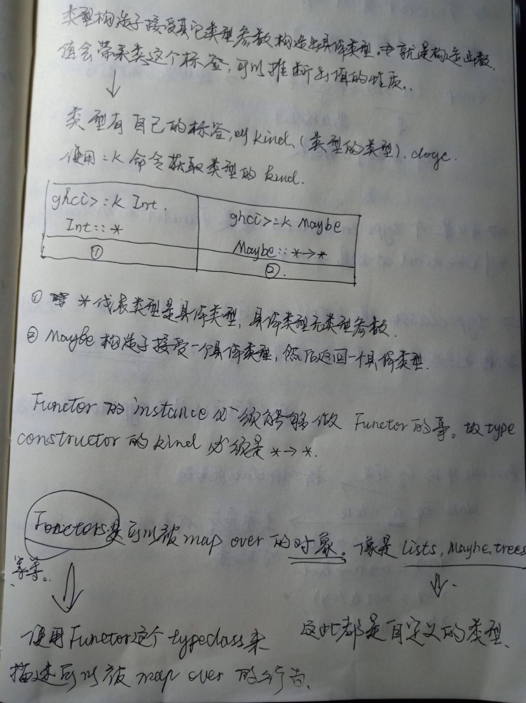
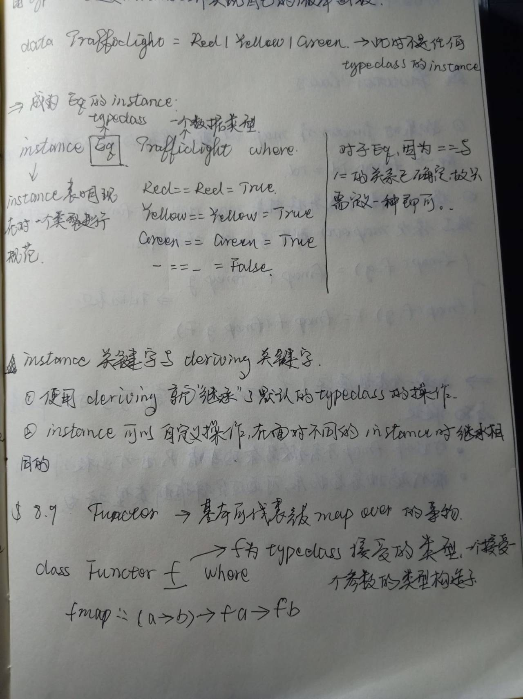
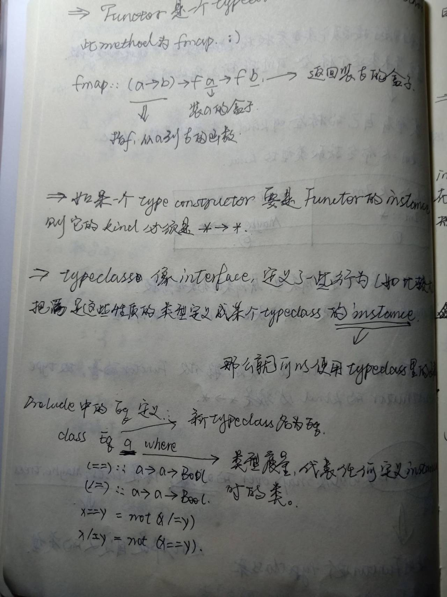
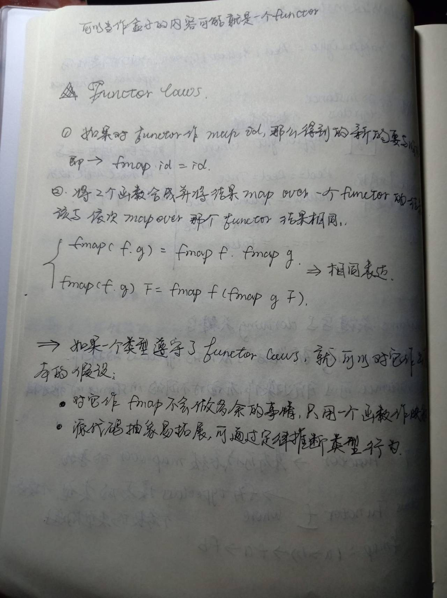

# Functor
被定义为Functor的instance可以使用famp，但在声明instance的环节要把fmap如何工作写清楚。
 
 
 
 

## functor与IO action的互动
### 将字符翻转1
```Haskell
import System.IO
main = do 
    line<-getLine
    let line' =reverse line
    putStrLn $ "you said" ++ line' ++" backwards"
    putStrLn $ "Yes , you really said "++line'++ "backwards"
```

### 将字符翻转2
主要举出Functor的使用方法。
```Haskell
--这个程序是不能通过编译的，因为IO是不允许重写的？
--a.hs:1:10: error:
--Duplicate instance declarations:
--instance Functor IO -- Defined at a.hs:1:10
--instance Functor IO -- Defined in ‘GHC.Base’
instance Functor IO where
    fmap f action = do
        result <- action
        return (f result)
main = do
--思考为什么本行可以运行？——因为getLine是Functor的instance，所以就可以使用fmap
    line <- fmap reverse getLine
    putStrLn $ "you said " ++ line ++" backwards"
    putStrLn $ "Yes , you really said "++line++ "backwards"
```

### fmap的使用：
在库里，已有的instace都有Functor这个typeclass，所以可以直接使用：
```Haskell
Prelude> fmap (*2) [1,2,3]
[2,4,6]  
Prelude> fmap reverse getLine
hello
"olleh"  
```
下面写了一个函数，同样也是直接使用了fmap，因为getLine已经是Functor的instance了。
```Haskell
import Data.Char
import Data.List
main = do
    line <- fmap(intersperse '-' . reverse . map toUpper) getLine
    putStrLn line
hello
O-L-L-E-H
hello world
D-L-R-O-W- -O-L-L-E-H
```

## Functor与(->) r
简单而言函数也可以进行运算
```Haskell
ghci>fmap (*3) (+100) 1
300
```

# Applicative functors
这个东西是加强版的functors，是`Control.Applicative`中的Applicative这个typeclass定义的。  
也即这是另外一个typeclass。
## 一些比较厉害的操作：
- 之前的functor用的是一个kind为`*->*`，比如说我要比较一个list和一个给定list的值的大小
```Haskell
--比较一个字符串和9的大小关系
fmap (compare 9) [3,4,2,1]
```
- 那么问题来了，如果我想把9这个数字变一下，或者说可以指定，那咋办呢？
```Haskell
let a = fmap (compare) [2,3,4,5]
fmap (\f= f 9) a

--进行一个list的加法：
let b = fmap (*) [1,2,3,4]
fmap (\f = f 9) b
--output
[9,18,27,36]
```

- 嗯，上面这些操作的类型是什么呢？使用`:t`来检测一下：
```Haskell
ghci> let a = fmap (*) [1,2,3,4]
ghci> :t a
a::[Integer->Integer]
```

### functor的麻烦：
大写的Functor是类型，而小写的functor表明Functor的一个instance。
**无法用fmap来吧包在一个functor的函数map令一个包在functor中的值**。只允许map一个普通的函数。

## classtype Applicative
### Applicative 的定义：
```Haskell
class (Functor f)=>Applicative f where
    pure::a-> f a
    (<*>)::f (a->b)->f a->f b
```
- 一个类型构造子f要是Applicative，必须也是Functor，所以这个类型可以使用fmap。
- pure的类型声明`pure::a->f a`。接受一个值，并返回一个applicative functor，里面装有结果。
- `<*>`这个类型，`<*>::f (a->b)->f a->f b`。  
与fmap的相似：`fmap::f (a->b)->f a->f b`.  
fmap 接受一个函数跟一个functor，然后套用functor之中的函数，`<*>`接受一个**装有函数的functor**跟令一个functor，然后取出第一个functor中的函数将他的第二个functor中得知做map。
==>上面这段话有点费解，functor中的值和函数是什么东西？functor是一个instance，所以说functor里面的值就是它的数据成员，函数就是他自己的成员函数嘛？
——好像并不是这样，有待进一步了解。

### 使用Applicative的实例：
嗯我觉得应该先把这个东西怎么用拉出来用一用，再把原理和运行方式讲一下。先看概念自己看有点难顶。   

```Haskell
Prelude> [(+0),(+100),(^2)] <*> [1,2,3]
[1,2,3,101,102,103,1,4,9]
Prelude> [(+),(*)] <*> [1,2] <*>  [3,4]
[4,5,5,6,3,4,6,8]

--list comprehension 的另一种表示方法
Prelude> (*) <$> [1,2,3] <*> [1,2,3]
[1,2,3,2,4,6,3,6,9]
```
### Maybe 的 Applicative实现
```Haskell
--类型Maybe:
data Maybe a =Nothing|Just a

instance Applicative Maybe where
--Just是一个函数，pure接受一个东西然后包装成applicative functor
    pure = Just
    
    --无法从Nothing中取出一个函数，所以说从Nothing中取出一个函数的结果必定是Nothing
    Nothing <*> _ = Nothing
    --从just中抽出函数f来map右边的值
    (Just f)<*> something = fmap f something
```

### <*>的简单使用：
```Haskell
ghci>Just (+3) <*> Just 9
Just 12
ghci>pure (+3) <*> Just 10
Just 13
ghci>pure (+3) <*> Just 9
Just 12
ghci>Just (+3) <*> Nothing
Nothing
ghci>Nothing <*> Just 3
Nothing
```
嗯这段代码比较有特点，首先关注类型Meybe，Meybe里面有一个类型是`Just a`，也就是说**just是一个函数，接受一个值然后返回一个Maybe类型**。  
看这里的使用，首先一个functor： Just +3对另外一个functor进行运算。  

一个Demo：
```Haskell
ghci> pure (+) <*> Just 3 <*> Just 5
Just 8
ghci> pure (+) <*> Just 3 <*> Nothing
Nothing
```
- pure是一个left-associative，左结合。首先+是摆在一个functor中，在这边刚好他是一个Maybe，pure (+)<=>Just (+)。 Just (+) <*> Just 3的结果我 Just (3+).最后 Just (3+)与Just 5运算得到just 8.


### 函数<$>
```Haskell
(<$>)::(Functor f)=>(a->b)->f a->f b
f <$> x = fmap f x
```
#### 一个<$>的小例子：
```Haskell
ghci> (++) <$> Just "hello" <*> Just "world"
Just "helloworld"
```
首先将++mapover到Just "hello",然后产生Just ("hello"++),然后再进行后续运算。

### liftA2的使用：
`listA2`函数在`Control.Applicative`中被定义。
```Haskell
liftA2::(Applicative f)=>(a->b->c)->f a->f b->f c
liftA2 f a b = f <$> a <*> b
```
那么希望Just中的值为一个list：
```Haskell
ghci> fmap (\x -> [x]) (Just 4)
Just [4]
--希望获得Just [3,4]
ghci> liftA2 (:) (Just 3) (Just 4)
Just [3,4]
```
### 自定义一个函数实现上面liftA2的功能、
```Haskell
--因为Applicative f 的相关操作已经被定义好了，所以此处就可以这么用了
sequanceA::(Applicative f)=> [f a]->f [a]
sequanceA []=pure []
--递回它不香嘛(/doge)
sequance (x:xs)= (:) <$> x <*> sequenceA xs
```

